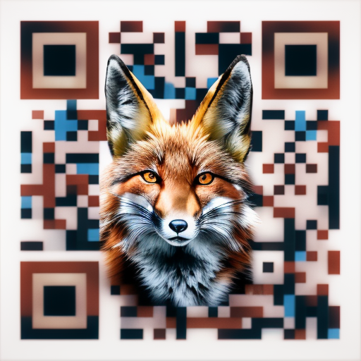

# Web AR Demo

## [Demo page](https://evgenii-d.github.io/web-ar-demo/)

|[Barcode for AR.js](assets/images/0_512.png)|[Marker for MindAR](assets/images/qr-fox.png)|
|---|---|
|||

Marker for MindAR made by Stable Diffusion ([DreamShaper](https://civitai.com/models/4384?modelVersionId=94081) model) from [this QR code](assets/images/qr-google.png) using IMG2IMG transformation.

### Stable Diffusion Parameters

Prompt: `red fox face, hdr, close-up photo`

Negative prompt: `ugly, disfigured, low quality, blurry, nsfw, bad eyes, crooked eyes, smudged eyes, not clear eyes, bad ear, bad proportions, blurry`

#### IMG2IMG Settings

|Option|Value|
|---|---|
|Steps|20|
|Sampler|Euler a|
|CFG scale|7|
|Seed|3410024854|
|Size|512x512|
|Model hash|853e7e85c4|
|Model|dreamshaper_631BakedVae|
|Denoising strength|0.75|

#### ControlNet Settings

|Option|Value|
|---|---|
|Preprocessor|tile_resample|
|Model|control_v11f1e_sd15_tile [a371b31b]|
|Weight|0.85|
|Starting/ending|(0.12, 1)|
|Resize mode|Crop and Resize|
|Pixel perfect|False|
|Control mode|Balanced|
|Preprocessor params|(-1, 1, -1)|

## Frameworks

- [A-Frame](https://github.com/aframevr/aframe/)
- [AR.js](https://github.com/AR-js-org/AR.js) | [Docs](https://ar-js-org.github.io/AR.js-Docs/)
  - [Barcode Markers collection](https://github.com/nicolocarpignoli/artoolkit-barcode-markers-collection)
- [MindAR](https://github.com/hiukim/mind-ar-js) | [Docs](https://hiukim.github.io/mind-ar-js-doc/)
  - [Image Analyzer](https://pictarize.com/image-analyzer/?ref=mindar.org)

## Decoders

- [Draco](https://github.com/google/draco/tree/master/javascript)
- [BasisTranscoder](https://github.com/BinomialLLC/basis_universal/tree/master/webgl/transcoder/build)
- [Meshopt](https://github.com/zeux/meshoptimizer/tree/master/js)

## 3D models

- [Wooden Buddha statuette](https://sketchfab.com/3d-models/wooden-buddha-statuette-675ce7f7a286400d84deb3bcaa38a93e)
- [Magnetic Field of Solenoid](https://sketchfab.com/3d-models/magnetic-field-of-solenoid-by-yuyalyj-70e36fd97e234c4a8f326e62191c02c2)
- [Robotic Arm](https://sketchfab.com/3d-models/black-honey-robotic-arm-c50671f2a8e74de2a2e687103fdc93ab)
